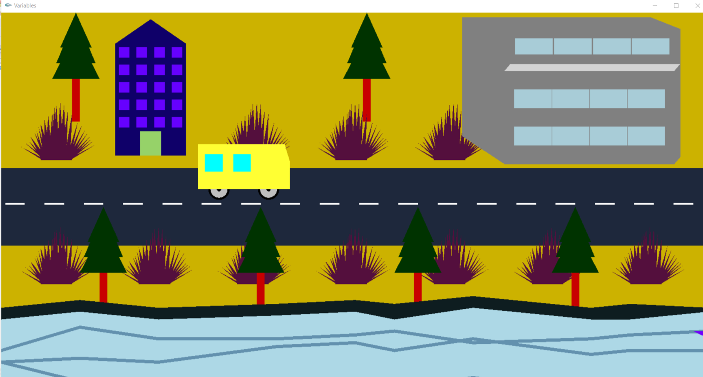
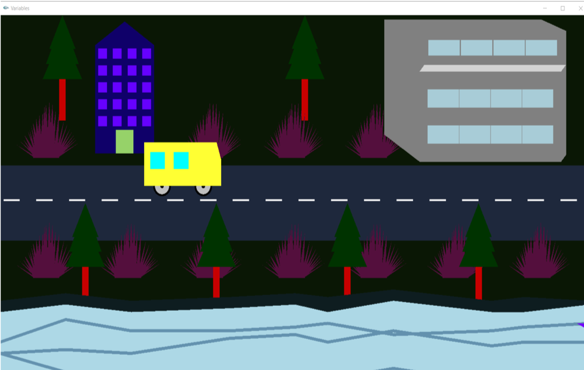

# graphics-project

<h1><u>Project Description:</u></h1>
A small view of a coastal city with a university campus. A man is waiting to go across the road in the bus stand and the woman is waiting for the bus to go to university. This is a perfect coastal city with modern buildings and seashore trees. 

Demo View: 

<b>Day View First Screen</b>

<b>Day View Second Screen</b>

<b>Night View</b>

<h2><u>Features:</u2></h2> 

1. Sea Beside the road 
2. Ship is moving with the mouse click 
3. Man is waiting to go across the road 
4. If the got crash by the bus the man will die 
5. The man will start moving after pressing "R" and stop movingif we press "S" 
6. Bus will move with the keyboard indicator sign 
7. Woman will waiting for the bus in the stand 
8. After pressing "Y" the woman will hop in the bus 
9. After reached the campus by pressing "a/A" she will get down 
10. AIUB D Building as a campus structure 
11. Christmas trees and grasses 

